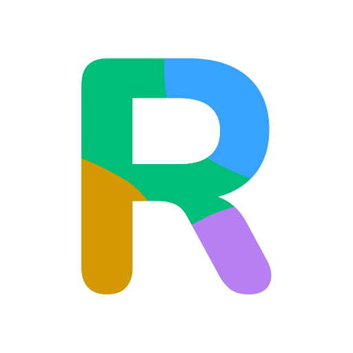

<a href="https://www.rawtoh.io/"></a>

**[Rawtoh](https://www.rawtoh.io/)** is a real-time automation platform that connects your favorite streaming tools
together. Create automations that react to events from Twitch, OBS, and more — all from a single place.

## How it works

Rawtoh acts as a central hub between your services. When something happens on one platform (a new subscriber on Twitch,
a scene change in OBS, etc.), Rawtoh picks it up and can trigger actions on any connected service.

```
Twitch  ─┐                  ┌─ Change OBS scene
OBS     ─┤──  Rawtoh Hub  ──┤─ Send a chat message
...     ─┘                  └─ Any JavaScript you write
```

Connect your services, define your triggers and actions in JavaScript, and let Rawtoh handle the rest.

## Modules

Rawtoh is built around **modules** — lightweight connectors that bridge external services to the platform:

| Module                | Description                                                        |
|-----------------------|--------------------------------------------------------------------|
| **module-bun-twitch** | Chat, events, and moderation via the Twitch API                    |
| **module-bun-obs**    | Full control of OBS Studio (scenes, sources, streaming, recording) |

Modules are **open source** — you can self-host them, customize them, or use them as a reference to build your own. The
core platform itself is closed source.

## Get started

Head over to **[rawtoh.io](https://www.rawtoh.io/)** to try it out.
